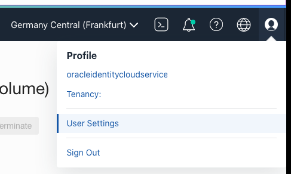
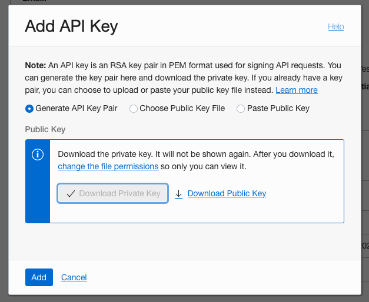
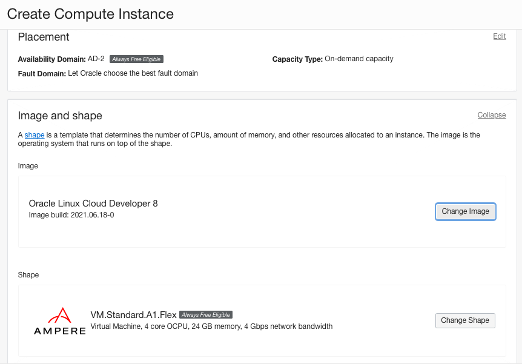
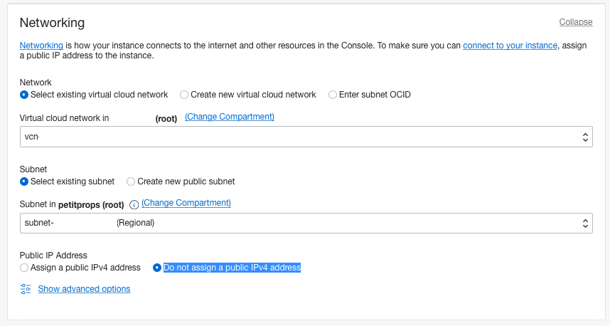
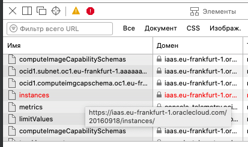
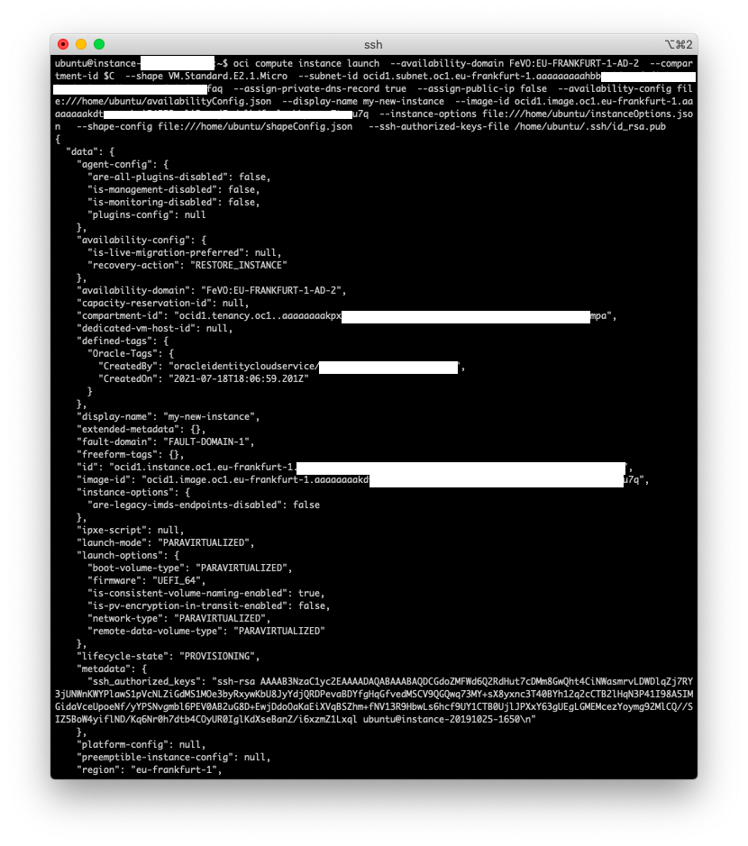
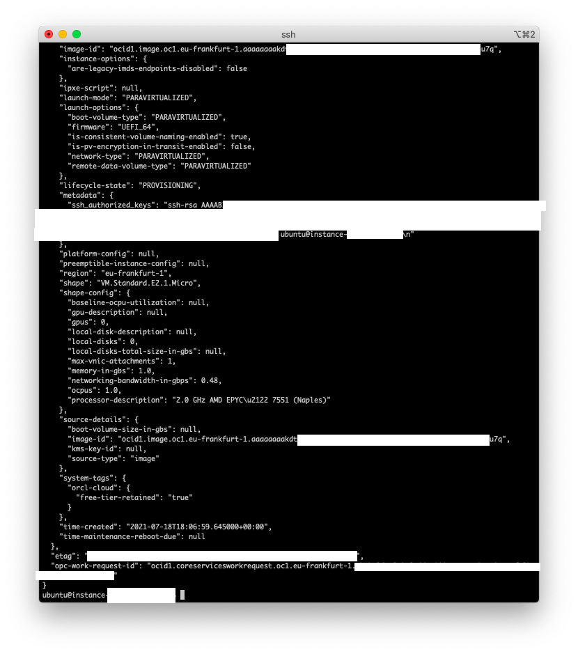
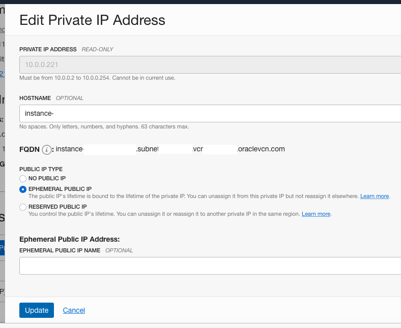

# Resolving Oracle Cloud "Out of Capacity" issue and getting free VPS with 4 ARM cores / 24GB of memory

<p align="center">
  <a href="https://github.com/hitrov/oci-arm-host-capacity/actions"></a>
  <a href="https://discord.gg/fKZQQStjMN"></a>
</p>

Very neat and useful configuration was recently [announced](https://blogs.oracle.com/cloud-infrastructure/post/moving-to-ampere-a1-compute-instances-on-oracle-cloud-infrastructure-oci) at Oracle Cloud Infrastructure (OCI) blog as a part of Always Free tier. Unfortunately, as of July 2021, it's very complicated to launch an instance due to the "Out of Capacity" error. Here we're solving that issue as Oracle constantly adds capacity from time to time.

> Each tenancy gets the first 3,000 OCPU hours and 18,000 GB hours per month for free to create Ampere A1 Compute instances using the VM.Standard.A1.Flex shape (equivalent to 4 OCPUs and 24 GB of memory).

This approach requires **PHP 7.4** or **PHP 8.0** and **composer** installed and will call "LaunchInstance" OCI API [endpoint](https://docs.oracle.com/en-us/iaas/api/#/en/iaas/20160918/Instance/LaunchInstance). We'll utilise the [package](https://packagist.org/packages/hitrov/oci-api-php-request-sign) which I've written (and [published](https://github.com/hitrov/oci-api-php-request-sign)) some time ago, here's the [article](https://hitrov.medium.com/creating-mini-php-sdk-to-sign-oracle-cloud-infrastructure-api-requests-d91a224c7008?sk=5b4405c1124bfeac30a370630fd94126).

If you prefer article style, here's a link to [Medium](https://hitrov.medium.com/resolving-oracle-cloud-out-of-capacity-issue-and-getting-free-vps-with-4-arm-cores-24gb-of-6ecd5ede6fcc?sk=01d761f7cd80c77e0fed773972f4d1a8)

YouTube video instruction [https://youtu.be/uzAqgjElc64](https://youtu.be/uzAqgjElc64).

- [Generating API key](#generating-api-key)
- [Installation](#installation)
- [Adjust script file](#adjust-script-file)
  - [Adjust OciConfig arguments 1–5](#adjust-ociconfig-arguments-15)
  - [Adjust OciConfig arguments 6-8](#adjust-ociconfig-arguments-6-8)
  - [Set public key value](#set-public-key-value)
- [Running the script](#running-the-script)
- [Assigning public IP address](#assigning-public-ip-address)
- [Conclusion](#conclusion)

## Generating API key

After logging in to [OCI Console](http://cloud.oracle.com/), click profile icon and then "User Settings"



Go to Resources -> API keys, click "Add API Key" button


Make sure "Generate API Key Pair" radio button is selected, click "Download Private Key" and then "Add".



Copy the contents from textarea and save it to file with a name "config". I put it together with *.pem file in newly created directory /home/ubuntu/.oci


## Installation

Clone this repository
```bash
git clone https://github.com/hitrov/oci-arm-host-capacity.git
```
run
```bash
cd oci-arm-host-capacity/
composer install
```

## Adjust script file

You need to slightly adjust index.php file - by changing OciConfig constructor arguments.

### Adjust OciConfig arguments 1–5

Arguments 1–5 (region, user, tenancy, fingerprint, path to private key) should be taken from textarea during API key generation step.

### Adjust OciConfig arguments 6-8

In order to acquire availabilityDomain, subnetId, imageId you must start instance creation process from the OCI Console in the browser (Menu -> Compute -> Instances -> Create Instance)

Change image and shape and make sure that "Always Free Eligible" availabilityDomain label is there:



Adjust Networking section, set "Do not assign a public IPv4 address" checkbox. If you don't have existing VNIC/subnet, please create VM.Standard.E2.1.Micro instance before doing everything.



"Add SSH keys" section does not matter for us right now. Before clicking "Create"…


…open browser's dev tools -> network tab. Click "Create" and wait a bit - most probably you'll get "Out of capacity" error. Now find /instances API call (red one)…



…and right click on it -> copy as curl. Paste the clipboard contents in any text editor and review the - data-binary parameter. Find availabilityDomain, subnetId, imageId. Use them as 6,7 and 8 arguments, respectively, to the OciConfig constructor.

OciConfig also has the last two arguments - ocpus and memoryInGBs (respectively). They are optional and are equals 4 and 24 by default. Of course, you can adjust them.  Possible values are 1/6, 2/12, 3/18 and 2/24, respectively. Please notice that "Oracle Linux Cloud Developer" image can be created with at least 8GB of RAM.

### Set public key value

In order to have secure shell (SSH) access to the instance you need to have a keypair, e.g. ~/.ssh/id_rsa and ~/.ssh/id_rsa.pub. Second one (public key) filename should be provided to a command below. The are plenty of tutorials on how to do that, we won't cover this part here.

Change the string variable $sshKey - paste the contents of your public key ~/.ssh/id_rsa.pub (or you won't be able to login into the newly created instance).

## Running the script

```bash
php /path/to/oci-arm-host-capacity/index.php
```

I bet that the output (error) will be similar to the one in a browser a few minutes ago

```json
{
    "code": "LimitExceeded",
    "message": "The following service limits were exceeded: standard-a1-memory-count, standard-a1-core-count. Request a service limit increase from the service limits page in the console. "
}
```

You can now setup periodic job to run the command

```bash
EDITOR=nano crontab -e
```

Add new line to execute the script every minute and log the output

```bash
* * * * * /usr/bin/php /path/to/oci-arm-host-capacity/index.php > /path/to/script.log
```

..and save the file.

There could be cases when cron user won't have some permissions, the easiest way to solve it is to put the code into web server's accessible directory e.g. /usr/share/nginx/html and setup cron this way:

```bash
* * * * * curl http://server.add.re.ss/oci-arm-host-capacity/index.php
```

You can also visit the URL above and see the same command output as by running from the shell.

Before the instance creation, script will call [ListInstances](https://docs.oracle.com/en-us/iaas/api/#/en/iaas/20160918/Instance/ListInstances) OCI API method and check whether there're already existing instances with the same `$shape`, as well as number of them `$maxRunningInstancesOfThatShape`(you can safely adjust the last one if you wanna e.g. two VM.Standard.A1.Flex with 2/12 each).

Script won't create new instance if current (actual) number return from the API exceeds the one from `$maxRunningInstancesOfThatShape` variable.

In case of success the JSON output will be similar to





## Assigning public IP address

We are not doing this during the command run due to the default limitation (2 ephemeral addresses per compartment). That's how you can achieve this. When you'll succeed with creating an instance, open OCI Console, go to Instance Details -> Resources -> Attached VNICs by selecting it's name


Then Resources -> IPv4 Addresses -> … -> Edit


Choose ephemeral and click "Update"



## Conclusion

That's how you will login when instance will be created (notice opc default username)

```bash
ssh -i ~/.ssh/id_rsa opc@ip.add.re.ss
```

If you didn't assign public IP, you can still copy internal FQDN or private IP (10.x.x.x) from the instance details page and connect from your other instance in the same VNIC. e.g.

```bash
ssh -i ~/.ssh/id_rsa opc@instance-20210714-xxxx.subnet.vcn.oraclevcn.com
```
